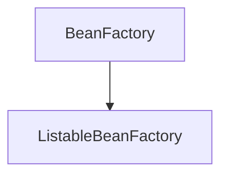

# 1. Spring 5 프로그래밍 입문
<!-- TOC -->

- [Spring 5 프로그래밍 입문](#spring-5-프로그래밍-입문)
    - [Chapter02 : 스프링 시작하기](#chapter02--스프링-시작하기)
        - [어노테이션 정리](#어노테이션-정리)
        - [객체 컨테이너](#객체-컨테이너)
    - [Chapter03 : 스프링 DI](#chapter03--스프링-di)
    - [Chapter04 : 의존 자동 주입](#chapter04--의존-자동-주입)

<!-- /TOC -->

## 1.1. Chapter02 : 스프링 시작하기

### 1.1.1. 어노테이션 정리

1. `@Configuration` : 스프링 설정 클래스로 지정
2.  `@Bean` : 스프링이 관리하는 빈 객체로 등록

### 1.1.2. 객체 컨테이너

1. 메이븐 의존 그래프

## 1.2. Chapter03 : 스프링 DI

## 1.3. Chapter04 : 의존 자동 주입
